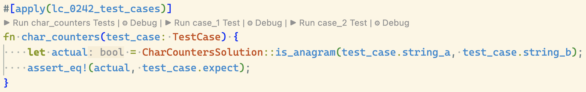

= Rust data structures and algorithms (DSA) practice

== Prerequisites

* Rust

== Testing

[source, bash]
----
# run all tests
cargo test

# only run tests from one file
cargo test --test lc_0057_insert_interval
----

=== Debugging Tests in VS Code

After installing the link:https://marketplace.visualstudio.com/items?itemName=rust-lang.rust-analyzer[rust-analyzer] extension, it should be possible to set breakpoints and debug tests using the buttons that appear inline over test functions.

